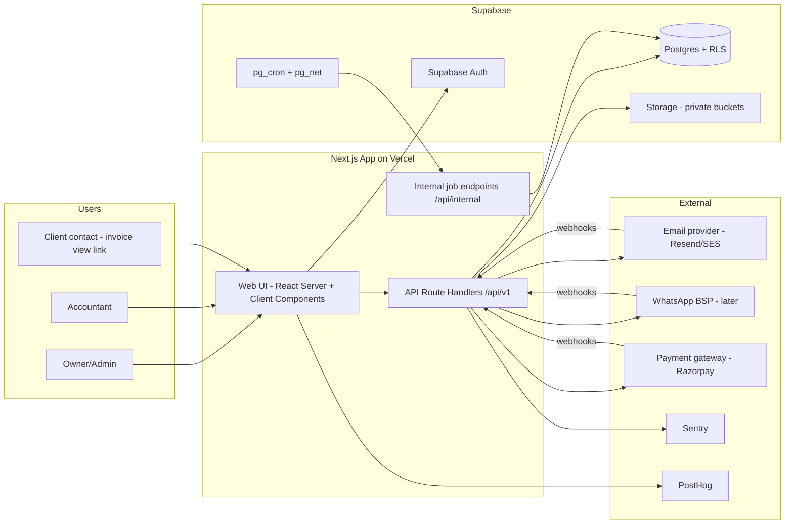
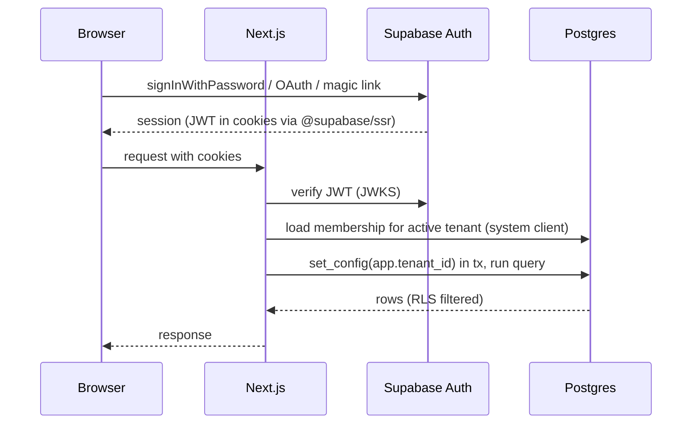
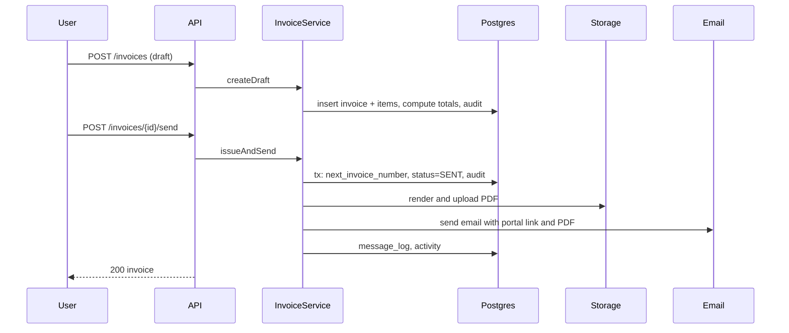
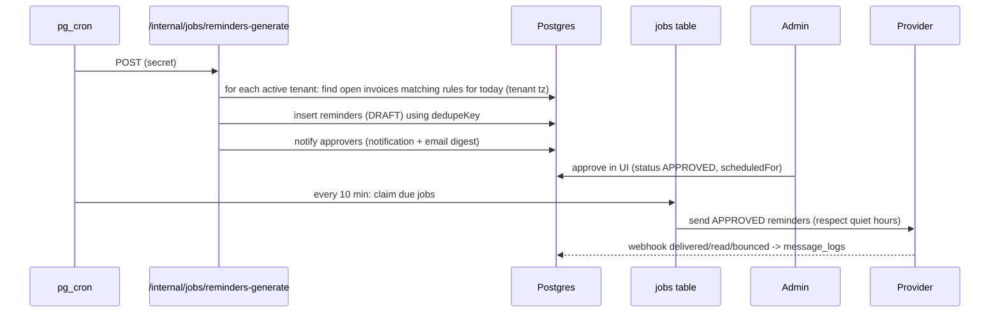

# System Architecture Document

Product: invoice-to-payment workflow platform for Indian micro/small B2B service firms. Stack chosen: **Next.js (TypeScript) + Supabase (Postgres, Auth, Storage) + Prisma ORM**, deployed on Vercel. Companion docs: `02-frontend`, `03-backend`, `04-database`.

---

## 1. Goals and constraints

| Goal | Meaning |
| --- | --- |
| Ship an MVP in about 8 weeks as a solo developer | Boring technology, one codebase, managed services |
| Safe with financial data | Tenant isolation, encryption, audit trail, DPDP readiness |
| Collections-first UX | Daily action list, approval-based reminders, weekly report |
| Cheap to run early | Target under Rs 10,000/month infrastructure until 40+ clients |
| Evolvable | Clear module boundaries so WhatsApp, bank matching, e-invoicing can be added without rewrites |

Non-goals for MVP: microservices, native mobile app, GST return filing, full accounting ledger, real-time collaboration.

Assumptions: web-first (responsive), India region data residency preferred (Supabase project in Mumbai `ap-south-1`), English UI first (Hindi later), INR only.

---

## 2. Architecture style

**Modular monolith** in one Next.js repository:

- One deployable web app (UI + API route handlers).
- Domain modules with strict internal boundaries (`invoices`, `clients`, `payments`, `reminders`, `imports`, `reports`, `billing`, `identity`).
- Background work through a DB-backed job queue executed by cron-triggered endpoints.
- External services behind interfaces (email, WhatsApp, payments gateway, PDF).

Why: one developer, one deployment, one on-call surface, simple transactions across domains (invoice + payment + audit in one DB transaction).

---

## 3. System context



---

## 4. Technology choices and rationale

| Concern | Choice | Alternative | Why |
| --- | --- | --- | --- |
| Framework | Next.js 15 App Router, React 19, TypeScript strict | Remix, SvelteKit | Single codebase for UI + API, large ecosystem, easy Vercel deploy |
| UI kit | Tailwind CSS + shadcn/ui (Radix) | MUI, Chakra | Own the components, accessible primitives |
| Data fetching (client) | TanStack Query v5 | SWR | Cache, mutations, optimistic updates, devtools |
| Forms/validation | React Hook Form + Zod (shared schemas) | Formik | One schema validates client and server |
| Tables | TanStack Table v8 | AG Grid | Headless, virtualised rows |
| Charts | Recharts | Chart.js | React-friendly, small needs |
| Database | Supabase Postgres | Neon, RDS | Managed, Mumbai region, Auth/Storage/cron in one place |
| ORM | Prisma | Drizzle | Chosen by the founder; strong migrations and types |
| Auth | Supabase Auth (email+password, magic link, Google, TOTP MFA) | Auth.js, Clerk | Already in the stack; MFA included |
| Storage | Supabase Storage (private) | S3 | Same provider, signed URLs |
| PDF | `@react-pdf/renderer` (server) or Playwright-based HTML-to-PDF via a separate worker if layouts need fidelity | wkhtmltopdf | Start with react-pdf (no browser binary on serverless) |
| Email | Resend (or AWS SES Mumbai) + React Email templates | SendGrid | Developer-friendly, DKIM/SPF support |
| WhatsApp (V1) | An official BSP (e.g., Gupshup, Twilio, Meta Cloud API) behind `MessageChannel` interface | Unofficial libraries (**avoid**: account-ban and policy risk) | Compliance |
| Payments (V1) | Razorpay (payment links, subscriptions) | Cashfree | Common in India; hosted pages mean no card data on your servers |
| Queue | Postgres `jobs` table + `SKIP LOCKED` | BullMQ/Redis, Inngest | No extra infra; enough for early volume |
| Scheduler | `pg_cron` + `pg_net` hitting protected endpoints (or Vercel Cron) | EventBridge | Keeps schedule in the DB |
| Observability | Sentry (errors), Axiom/Logtail (logs), BetterStack (uptime), PostHog (product analytics) | Datadog | Cost |
| Testing | Vitest, Testing Library, Playwright, MSW | Jest | Fast, TS-native |
| CI/CD | GitHub Actions + Vercel previews | CircleCI | Simple |
| Package manager | pnpm | npm | Speed, workspaces |

---

## 5. Logical architecture (layers)

```
Browser
  └─ Next.js UI (app/(marketing), app/(auth), app/(app))
       └─ calls /api/v1/* via typed fetch client (TanStack Query)
API layer (route handlers)  src/app/api/v1/**/route.ts
  ├─ middleware: request id, rate limit, auth, tenant resolution, RBAC
  ├─ validation: Zod
  └─ calls Service layer
Service layer (domain logic)  src/server/modules/<domain>/*.service.ts
  ├─ business rules (status machine, allocation, numbering, reminder rules)
  ├─ opens Prisma transactions with tenant context
  └─ emits domain events (audit, notifications, jobs)
Data layer  src/server/db/*  (Prisma client, tenant extension, system client)
Integrations  src/server/integrations/* (email, whatsapp, payments, pdf, storage)
Jobs  src/server/jobs/* (handlers registered by type)
```

Rules:

1. Route handlers contain no business logic.
2. Services never import from `app/`.
3. Only services touch Prisma; UI never imports server modules.
4. Shared types/schemas live in `src/shared` (Zod + inferred types) and are importable by client and server.
5. Integrations are accessed through interfaces; swap by env/config.

---

## 6. Repository layout

```
/
├─ prisma/
│  ├─ schema.prisma
│  ├─ migrations/
│  └─ seed.ts
├─ supabase/                 # supabase CLI config, local dev, SQL helpers
├─ src/
│  ├─ app/
│  │  ├─ (marketing)/        # public pages
│  │  ├─ (auth)/             # login, signup, etc.
│  │  ├─ (onboarding)/
│  │  ├─ (app)/app/...       # authenticated product
│  │  ├─ (portal)/p/[token]  # public invoice view
│  │  ├─ (admin)/admin/...   # internal back-office
│  │  └─ api/
│  │     ├─ v1/...           # public/product API
│  │     ├─ internal/...     # cron-only
│  │     └─ webhooks/...     # provider callbacks
│  ├─ components/            # ui/, forms/, tables/, charts/, layout/
│  ├─ features/              # feature folders (invoices, clients, ...) with hooks, components, api client
│  ├─ shared/                # zod schemas, enums, constants, utils (money, dates, gst)
│  ├─ server/
│  │  ├─ auth/ db/ modules/ integrations/ jobs/ pdf/ email-templates/
│  │  └─ lib/ (errors, logger, rate-limit, idempotency)
│  └─ styles/
├─ tests/ (unit, integration, e2e)
├─ .github/workflows/
└─ docs/ (these documents, ADRs, runbooks)
```

---

## 7. Multi-tenancy design

- Model: shared database, shared schema, `tenantId` on every business row.
- Enforcement: (1) every service query filters by `tenantId`; (2) Postgres RLS with `app.tenant_id` set per transaction; (3) runtime DB role cannot bypass RLS.
- Resolution: authenticated user → memberships → active tenant from signed cookie; server verifies the user belongs to that tenant on every request.
- Cross-tenant users (accountant with several clients) switch tenant via `/app/switch`; the cookie is re-issued after membership check.
- Internal/system operations use a separate `app_system` role and client with explicit audit entries.

---

## 8. Authentication and authorization



RBAC matrix (enforced in `requirePermission(ctx, 'invoice:create')`):

| Permission | Owner | Admin | Accountant | Viewer |
| --- | --- | --- | --- | --- |
| tenant:manage, billing:manage, members:manage | Yes | No | No | No |
| invoice:create/edit/send/void | Yes | Yes | No | No |
| payment:record/reverse | Yes | Yes | No | No |
| reminder:approve | Yes | Yes (if `canApprove`) | No | No |
| rules/templates:manage | Yes | Yes | No | No |
| client:create/edit | Yes | Yes | No | No |
| import:run | Yes | Yes | No | No |
| report:view/export | Yes | Yes | Yes | Yes |
| invoice/client/payment:read | Yes | Yes | Yes | Yes |
| audit:view | Yes | Yes | Yes | No |
| data:export/erase | Yes | No | No | No |

Security controls: MFA required for Owners (enforced after onboarding), session lifetime 7 days with refresh rotation, password policy via Supabase, rate limits per IP and per user, CSRF protection (same-site cookies + origin check on mutating requests), CSP headers, no secrets in the client bundle.

---

## 9. Key flows

### 9.1 Create and send an invoice



### 9.2 Daily reminder cycle



Guard checks before send: invoice still open, balance > 0, client not paused, contact has consent and not unsubscribed, no payment recorded since draft, quiet hours/weekend settings, monthly plan limits.

### 9.3 Record a payment

1. User posts payment with allocations (or "auto-allocate oldest first").
2. Service validates amounts: `sum(allocation.amount + tds) <= invoice.balanceDue` each; `sum(amount) <= payment.amount`.
3. In one transaction: insert payment + allocations, update invoices (`amountPaid`, `balanceDue`, status, `paidAt`), cancel pending reminders for fully paid invoices, write activity + audit.
4. Remainder stored as `unallocatedAmount` (advance).

### 9.4 Import

Upload via signed URL → create `ImportJob` → parse header → user maps columns → validation job writes `ImportRow`s with errors/duplicates → user reviews → commit job inserts in batches of 200 inside transactions → completion notification and error CSV.

### 9.5 Public invoice view

`/p/{publicToken}` (no login) shows invoice summary and PDF, records a view event (increments `viewCount`, sets `firstViewedAt`), rate-limited, token unguessable, can be revoked by regenerating the token, never shows other invoices of the client unless "statement" feature is enabled later.

---

## 10. Background processing

| Job type | Trigger | Idempotency | Notes |
| --- | --- | --- | --- |
| `reminders.generate` | Daily 09:00 IST (cron) | `dedupeKey` on reminders | Per tenant, per rule |
| `reminders.dispatch` | Every 10 min | status transitions guarded with `UPDATE ... WHERE status='APPROVED'` | Honors quiet hours |
| `report.weekly` | Monday 08:00 IST | `uniqueKey = weekly:{tenant}:{yyyy-ww}` | Email PDF/summary to owners |
| `invoice.pdf` | On issue | `uniqueKey = pdf:{invoice}:{version}` | Retry on failure |
| `import.validate` / `import.commit` | On user action | Job per `ImportJob` | Chunked |
| `recurring.run` | Daily | `uniqueKey = rec:{template}:{date}` | V1 |
| `webhook.process` | Provider callbacks | `webhook_events(provider,eventId)` unique | Return 200 fast |
| `retention.cleanup` | Daily | n/a | Deletes expired files/logs |

Runner: `/api/internal/jobs/run` claims up to N jobs (`SKIP LOCKED`), runs handlers with timeout under the serverless limit, reschedules with backoff, marks `DEAD` after max attempts and alerts via Sentry.

---

## 11. Integrations (interfaces)

```ts
interface MessageChannel {
  channel: 'EMAIL' | 'WHATSAPP' | 'SMS';
  send(msg: { to: string; subject?: string; body: string; templateId?: string; vars?: Record<string,string>;
              attachments?: {name: string; url: string}[]; idempotencyKey: string }): Promise<{ providerMessageId: string }>;
  parseWebhook(req: Request): Promise<MessageEvent[]>;
}
interface PdfRenderer { renderInvoice(invoiceId: string): Promise<Buffer>; }
interface PaymentGateway { createPaymentLink(...): Promise<...>; verifyWebhook(...): boolean; }
interface FileStore { signedUploadUrl(...); signedDownloadUrl(...); put(...); remove(...); }
```

Each has a real adapter and an in-memory fake for tests. WhatsApp requires pre-approved templates and recorded opt-in; email requires SPF, DKIM, DMARC on the sending domain and an unsubscribe mechanism.

---

## 12. Security architecture

| Area | Controls |
| --- | --- |
| Data isolation | App-level scoping, RLS (forced), non-bypass runtime role, isolation tests in CI |
| Transport/rest | TLS everywhere, Supabase encryption at rest, private buckets, signed short-lived URLs |
| Secrets | Vercel/Supabase env vars, server-only; rotate quarterly; no secrets in repo (gitleaks in CI) |
| Input | Zod validation, file allow-list, size caps, CSV formula-injection sanitising on export (prefix `'` to cells starting with `= + - @`) |
| Auth | MFA for owners, device/session list, rate-limited login, email verification |
| API | Per-IP/user rate limits, idempotency keys on POST, request size limits, CORS locked to app origin |
| Webhooks | Signature verification, replay window, event dedupe |
| Logging | Structured JSON; no PII/body payloads; request id propagated |
| Audit | Immutable `audit_logs`, UI for owners/accountants |
| Dependencies | Dependabot, `pnpm audit`, lockfile pinning |
| Privacy | DPDP: processor agreement, retention, erase/export workflow, breach runbook (72-hour readiness) |
| Pre-launch | Independent security review/pen-test, threat model (STRIDE) updated per release |

Threat model highlights: tenant ID tampering (mitigated by server-side tenant resolution + RLS), IDOR on invoice IDs (UUID + tenant filter), public portal token guessing (UUID v4 + rate limit), malicious CSV/XLSX (parse in sandboxed worker, size/row limits), reminder abuse as spam (approval, limits, consent flags), webhook spoofing (signatures), insider access (support access is time-boxed and audited).

---

## 13. Environments and deployment

| Env | Frontend | DB | Purpose |
| --- | --- | --- | --- |
| Local | `pnpm dev` | `supabase start` (Docker) | Development |
| Preview | Vercel PR previews | Shared staging project or branch DB | Review |
| Staging | `staging.app...` | Separate Supabase project | Pre-release tests, migrations dry-run |
| Production | `app...` | Supabase project (Mumbai), PITR on | Live |

CI pipeline (GitHub Actions): install → lint → typecheck → unit tests → integration tests (Postgres service) → build → Playwright smoke on preview → deploy. Production deploy requires green checks and manual approval; `prisma migrate deploy` runs as a separate gated step before app promotion.

Release practice: trunk-based, feature flags via env/config table, semantic changelog, rollback by Vercel instant rollback plus backward-compatible migrations (expand/contract).

Domains: `www` marketing, `app` product, `mail`/`notify` sending subdomain with SPF/DKIM/DMARC.

---

## 14. Observability and operations

- Errors: Sentry for browser, server and job handlers (release tracking, source maps).
- Logs: JSON with `requestId`, `tenantId`, `userId`, `route`, `durationMs`.
- Metrics/dashboards: request latency, error rate, job queue depth, reminders sent/failed, bounce rate, import failures, DB connections, storage use.
- Alerts: job `DEAD` count > 0, 5xx rate > 2% for 5 min, cron missed run, DB CPU > 80%, bounce rate > 5%.
- Uptime: external pings on `/api/health` (DB + storage check) and `/p/health`.
- Runbooks (docs/runbooks): incident response, restore from backup, rotate keys, failed migration, provider outage (switch email provider), data breach.
- Support access: read-only impersonation requires owner consent and is audited.

---

## 15. Performance and scalability

| Dimension | Target at MVP | Scale levers |
| --- | --- | --- |
| Page load | LCP \< 2.5s, API p95 \< 400ms | Server Components, caching, indexes |
| Capacity | 100 tenants x 5k invoices | Pooler, pagination, partial indexes |
| Jobs | 50 tenants daily generation under 2 min | Batch per tenant, parallelise with concurrency 5 |
| Growth path | 1,000 tenants | Add read replica, move jobs to a worker (Fly/Render), table partitioning for `audit_logs`/`message_logs` by month, Redis cache |

Connection management: serverless functions use the Supavisor pooler with `connection_limit=1`; long jobs and imports use an interactive transaction with timeouts.

---

## 16. Cost estimate (early, verify current vendor pricing)

| Item | Estimate/month |
| --- | --- |
| Vercel (Pro) | about USD 20 |
| Supabase (Pro, small compute) | about USD 25+ |
| Email (Resend/SES) | USD 0-20 |
| Sentry/logs/uptime | USD 0-30 |
| WhatsApp provider | per-message; verify current rates |
| Domain, misc | small |
| Total typical: about Rs 6,000-10,000 before WhatsApp. |  |

---

## 17. Architecture decision records (summary)

| ADR | Decision | Status |
| --- | --- | --- |
| 001 | Modular monolith on Next.js | Accepted |
| 002 | Supabase for Postgres/Auth/Storage; Prisma as the only data access path; Data API disabled | Accepted |
| 003 | RLS forced with `app_runtime` role plus app-level tenant scoping | Accepted |
| 004 | DB-backed job queue, cron-triggered | Accepted |
| 005 | Reminders require human approval by default | Accepted |
| 006 | Invoice status stored as lifecycle; overdue derived | Accepted |
| 007 | Money as Decimal(14,2), API returns strings | Accepted |
| 008 | Official WhatsApp BSP only; email first | Accepted |
| 009 | No GST filing/e-invoice in MVP; design for GSP adapter later | Accepted |
| 010 | Public invoice portal via unguessable token | Accepted |

---

## 18. Roadmap mapped to architecture

| Phase | Weeks | Modules delivered |
| --- | --- | --- |
| 0 Foundation | 1 | Repo, CI, Supabase projects, auth, tenant + RBAC, design system shell |
| 1 Core ledger | 2-3 | Clients, invoices, items, series, PDF, send by email, payments, allocations |
| 2 Import + status | 4 | Import wizard, ageing, invoice timeline, disputes |
| 3 Reminders | 5 | Templates, rules, generation job, approval queue, dispatch, webhooks |
| 4 Reports + hardening | 6-7 | Dashboard, weekly report, exports, audit UI, security review, DPDP docs |
| 5 Pilot | 8 | Onboarding wizard, billing/plan limits, feedback tooling |
| V1 | After pilots | WhatsApp, payment links, bank CSV matching, recurring invoices, accountant portal |
| V2 | Later | Auto bank matching, OCR, Tally/Zoho sync, GSP e-invoice, public API |

---

## 19. Open questions to settle early

1. PDF engine fidelity: react-pdf sufficient or HTML-to-PDF worker needed?
2. WhatsApp BSP choice and template approval timeline.
3. Whether MFA is mandatory for all roles or Owners only at launch.
4. Retention periods confirmed by CA/lawyer.
5. Whether invoices must support multi-currency (currently INR only).